  

  

---

## ✨ About Me

Full Stack Developer at **Programmers**, building scalable systems and real-world solutions.
Passionate about clean code, agile methods, software architecture, and continuous improvement.

- 🔭 Working on enterprise microservices applications (C# • Node.js • React)
- 🤖 Building a **Multi-Agent Customer Support Assistant** — AI SAC with CrewAI, RAG & Gemini
- 🌱 Studying Software Architecture, Multi-Agent AI Systems, and Agile methods
- 💼 Interests: Software Engineering, Full Stack Development, Applied AI
- 🧠 Focused on scalable applications and system design

---

## 🛠️ Tech Stack

**Backend**

**Frontend**

**AI & Data**

**Databases**

**DevOps & Tools**

---

## 🚀 Projects

**🤖 Multi-Agent Customer Support Assistant**
Multi-agent AI SAC for Products, Deliveries & Payments, grounded in RAG.
`Python` • `CrewAI` • `RAG` • `Gemini`
🔗 [github.com/HenricoHosaki/MultiAgentAssistant](https://github.com/HenricoHosaki/MultiAgentAssistant)

**🏭 KadMill**
Management system for LR Usinagem.
`TypeScript` • `React` • `PostgreSQL` • `Docker` • `Render`

**📦 Inventory System**
`Node.js` • `PostgreSQL` • `Docker` • `Render`

**🔐 REST API (Auth & CRUD)**
Backend architecture and API development studies.

---

## 📊 GitHub Stats

 

---

## 📊 Detailed Metrics

  

---

## 📫 Contact

